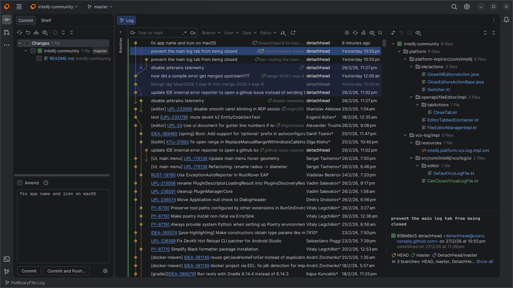

#  Rebased

A git client based on the IntelliJ platform.

Rebased is an open-source remake of the short-lived [jetbrains git client](https://youtrack.jetbrains.com/issue/IJPL-72504/Make-git-client-a-standalone-app#focus=Comments-27-12868395.0-0).
It's basically just a JetBrains IDE with all the bundled plugins removed except the git integration, with some additional UI tweaks.



## Why?

See [this youtrack issue](https://youtrack.jetbrains.com/issue/IJPL-72504/Make-git-client-a-standalone-app) for the many reasons people have been requesting this for almost a decade. At the time of writing, it's the #3 most upvoted open issue on YouTrack.

## Installation

### Linux

Download the appimage from [GitHub releases](https://github.com/DetachHead/rebased/releases).

We recommend using either [AppManager](https://github.com/kem-a/AppManager) or [Gear Lever](https://github.com/mijorus/gearlever) to install it to your applications menu, and for automatic updates.

### Windows

You can either download the installer `.exe` from [GitHub releases](https://github.com/DetachHead/rebased/releases) or install via winget:

```ps1
winget install detachhead.rebased --source winget
```

### macOS

Install with [homebrew](https://brew.sh/):

```bash
brew install detachhead/tap/rebased
```

<details>
  <summary>Manual installation</summary>

  Download the `.dmg` from [GitHub releases](https://github.com/DetachHead/rebased/releases)

  After copying `Rebased.app` to your Applications folder, you may see the following error message:
  > "Rebased.app" is damaged and can't be opened. You should move it to the Bin.

  **This is Apple lying to you.** Nothing is "damaged", it's just not code-signed with an Apple Developer certificate. To fix it, run the following command:
  ```bash
  xattr -rd com.apple.quarantine /Applications/Rebased.app
  ```
</details>

## Exclusive Features

In addition to all the git-related features from [IntelliJ IDEA Community Edition](https://github.com/jetbrains/intellij-community), Rebased has some additional features which aren't available in any of the official JetBrains IDEs.

### Option to disable the `.idea` directory

Unlike the `.vscode` directory, most of the config files generated by JetBrains IDEs are unfortunately not suitable to commit, as they often contain device-specific file paths that don't work if shared with other members of your team.

Rebased is intended to be used with a wider variety of projects, which means you're more likely to use it with repos that weren't intended to be opened in a JetBrains IDE. This means `.idea` config files aren't committed nor are they excluded in `.gitignore`. This results in Rebased generating unwanted config files most of the time.

To address this problem, Rebased allows you to disable the creation of the `.idea` directory in the project root:

1. Go to *Settings > Appearance and Behavior > System Settings*
2. Uncheck "Store project settings in the project root directory"

> [!NOTE]
> This does not disable project-level config. Instead, Rebased will store each project's config inside a single centralized `.idea` directory in the same place as the IDE's global settings.

### Additional TextMate bundles

IntelliJ Community Edition includes syntax highlighting for many languages, even when their corresponding language plugin is not installed, thanks to the [TextMate Bundles](https://plugins.jetbrains.com/plugin/7221) plugin.

Unfortunately however, syntax highlighting is only available for some languages in their respective paid plugins/IDEs.

One of the goals of Rebased is to prevent users from having to install bloated plugins when they only want basic editor/git functionality, so we ship some additional TextMate bundles that aren't present in IntelliJ:

- [vue](https://github.com/vuejs/language-tools)

(currently only one language, but feel free to open an [issue](https://github.com/DetachHead/rebased/issues/new/choose) or [PR](https://github.com/DetachHead/rebased/compare) for others)

## Credits

- https://github.com/obiscr/intellij-community - a previous attempt at creating a jetbrains git client that i cherrypicked some commits from
- jetbrains, obviously

-----

> [!NOTE]
> The remainder of this readme is mostly unchanged from the upstream intellij-community repo.

## Getting the Source Code

This section will guide you through getting the project sources and help avoid common issues in git config and other steps before opening it in the IDE.

#### Prerequisites
- [Git](https://git-scm.com/) installed
- Install [IntelliJ IDEA 2023.2](https://www.jetbrains.com/idea/download) or higher.
- For **Windows** set these git config to avoid common issues during cloning:
  ```
  git config --global core.longpaths true
  git config --global core.autocrlf input
  ```

#### Clone Main Repository

IntelliJ open source repository is available from the [GitHub repository](https://github.com/detachhead/rebased), which can be cloned or downloaded as a zip file (based on a branch) into `<IDEA_HOME>`. 
The **master** (_default_) branch contains the source code which will be used to create the next major version of all JetBrains IDEs. 
The branch names and build numbers for older releases of JetBrains IDEs can be found on the
[Build Number Ranges](https://plugins.jetbrains.com/docs/intellij/build-number-ranges.html) page.

You can [clone this project](https://www.jetbrains.com/help/idea/manage-projects-hosted-on-github.html#clone-from-GitHub) directly using IntelliJ IDEA. 

Alternatively, follow the steps below in a terminal:

   ```
   git clone https://github.com/detachhead/rebased.git --recurse-submodules
   cd rebased
   ```

> [!TIP]
> - **For faster download**: If the complete repository history isn't needed, create [shallow clone](https://git-scm.com/docs/git-clone#Documentation/git-clone.txt---depthdepth)
> To download only the latest revision of the repository,  add `--depth 1` option after `clone`.
> - Cloning in IntelliJ IDEA also supports creating shallow clone.

> [!NOTE]
> This project requires additional Android modules from separate Git repositories, which is why `--recurse-submodules` is needed. Ideally these should not be needed since Rebased
> is not built with the Android plugin, but it seems too tightly integrated with the codebase to be able to easily remove it. So for now I've kept it as a git submodule instead of
> relying on a script. This way, the project is always pinned to a version of the android repo that works with it.

---
## Building Rebased

> [Standard GitHub runners](https://docs.github.com/en/actions/concepts/runners/github-hosted-runners) can no longer be used to build the project due to the disk size limitation.
> Now we use [larger runners](https://docs.github.com/en/enterprise-cloud@latest/actions/concepts/runners/larger-runners) which are only available for organizations and enterprises using the GitHub Team or GitHub Enterprise Cloud plans.
> Users of personal GitHub accounts can use [the prebuilt binaries](https://github.com/JetBrains/intellij-community/releases), 
> or build IntelliJ IDEA from source code locally.

These instructions will help you build Rebased from source code, which is based on the IntelliJ community edition. These instructions are mostly unchanged from upstream for now
so they might be inaccurate because this project is still in early development and I am still learing how everything works and changing things around.
IntelliJ IDEA '**2023.2**' or newer is required.

### Opening the IntelliJ IDEA Source Code in the IDE
Using the latest IntelliJ IDEA, click '**File | Open**', select the `<IDEA_HOME>` directory.
If IntelliJ IDEA displays a message about a missing or out-of-date required plugin (e.g. Kotlin),
[enable, upgrade, or install that plugin](https://www.jetbrains.com/help/idea/managing-plugins.html) and restart IntelliJ IDEA.


### Build Configuration Steps
1. **JDK Setup**

- Use JetBrains Runtime 21 (without JCEF) to compile
  - IDE will prompt to download it on the first build
> [!IMPORTANT]
>
> JetBrains Runtime **without** JCEF is required. If `jbr-21` SDK points to JCEF version, change it to the non-JCEF version:
> - Add `idea.is.internal=true` to `idea.properties` and restart the IDE.
> - Go to '**Project Structure | SDKs**'
> - Click 'Browse' → 'Download...'
> - Select version 21 and vendor 'JetBrains Runtime'
> - To confirm if the JDK is correct, navigate to the SDK page with jbr-21 selected. Search for `jcef`, it should **_NOT_** yield a result.

2. **Maven Configuration** : If the **Maven** plugin is disabled, [add the path variable](https://www.jetbrains.com/help/idea/absolute-path-variables.html) "**MAVEN_REPOSITORY**" pointing to `<USER_HOME>/.m2/repository` directory.

3. **Memory Settings**
  - Ensure a minimum **8GB** RAM on your computer.
  - With the minimum RAM, disable "**Compile independent modules in parallel**" in '**Settings | Build, Execution, Deployment | Compiler**'.
  - With notably higher available RAM, Increase "**User-local heap size**" to `3000`.


### Building the IntelliJ IDEA Application from Source

**To build IntelliJ IDEA from source**, choose '**Build | Build Project**' from the main menu.

**To build installation packages**, run the [installers.cmd](installers.cmd) script in `<IDEA_HOME>` directory. `installers.cmd` will work on both Windows and Unix systems.
Options to build installers are passed as system properties to `installers.cmd` command.
You may find the list of available properties in [BuildOptions.kt](platform/build-scripts/src/org/jetbrains/intellij/build/BuildOptions.kt)

Installer build examples:
```bash
# Build installers only for current operating system:
./installers.cmd -Dintellij.build.target.os=current
```
```bash
# Build source code _incrementally_ (do not build what was already built before):
./installers.cmd -Dintellij.build.incremental.compilation=true
```

> [!TIP]
> 
> The `installers.cmd` is used to run [OpenSourceCommunityInstallersBuildTarget](build/src/OpenSourceCommunityInstallersBuildTarget.kt) from the command line.
> You can also call it directly from IDEA, using run configuration `Build IntelliJ IDEA Installers (current OS)`.


#### Dockerized Build Environment
To build installation packages inside a Docker container with preinstalled dependencies and tools, run the following command in `<IDEA_HOME>` directory (on Windows, use PowerShell):
```bash
docker build . --target intellij_idea --tag intellij_idea_env
docker run --rm --user "$(id -u)" --volume "${PWD}:/community" intellij_idea_env
```
> [!NOTE]
> 
> Please remember to specify the `--user "$(id -u)"` argument for the container's user to match the host's user.
> This prevents issues with permissions for the checked-out repository, the build output, and the mounted Maven cache, if any.
> 
To reuse the existing Maven cache from the host system, add the following option to `docker run` command:
`--volume "$HOME/.m2:/home/ide_builder/.m2"`

---
## Running IntelliJ IDEA
To run the IntelliJ IDEA that was built from source, choose '**Run | Run**' from the main menu. This will use the preconfigured run configuration `IDEA`.

To run tests on the build, apply these settings to the '**Run | Edit Configurations... | Templates | JUnit**' configuration tab:
* Working dir: `<IDEA_HOME>/bin`
* VM options:  `-ea`


#### Running IntelliJ IDEA in CI/CD environment

To run tests outside of IntelliJ IDEA, run the `tests.cmd` command in `<IDEA_HOME>` directory.`tests.cmd` can be used in both Windows and Unix systems.
Options to run tests are passed as system properties to `tests.cmd` command.
You may find the list of available properties in [TestingOptions.kt](platform/build-scripts/src/org/jetbrains/intellij/build/TestingOptions.kt)

```bash
# Build source code _incrementally_ (do not build what was already built before): `
./tests.cmd -Dintellij.build.incremental.compilation=true
```
```bash
#Run a specific test: 
./tests.cmd -Dintellij.build.test.patterns=com.intellij.util.ArrayUtilTest
```

`tests.cmd` is used just to run [CommunityRunTestsBuildTarget](build/src/CommunityRunTestsBuildTarget.kt) from the command line.
You can also call it directly from IDEA, see run configuration `tests` for an example.
